# ChatGPT vs. Perplexity: I Tested Both AI Chatbots with 5 Real Prompts

---

Choosing between AI chatbots can feel overwhelming when you need accurate answers fast. I put ChatGPT-4o and Perplexity AI through five practical tests—from fact-checking movie data to crafting creative stories—to see which one delivers better accuracy, creativity, and usability. Whether you're researching, writing, or solving everyday problems, this head-to-head comparison shows you exactly what each AI chatbot does well (and where they stumble), so you can pick the right tool for your needs.

---

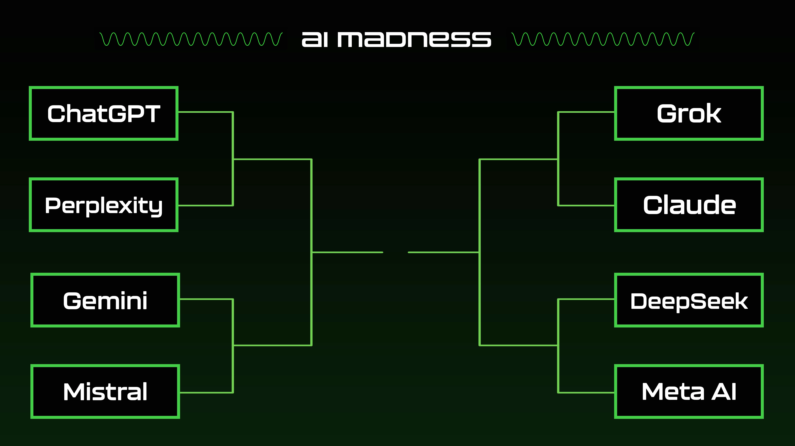

So here we are. First round of AI Madness, and it's ChatGPT-4o versus Perplexity AI. Two heavyweights. Both promise to make your life easier. But which one actually delivers?

OpenAI's ChatGPT has this reputation—you know the one. Reliable. Sharp. Conversational in a way that doesn't feel robotic. It's like talking to someone who actually gets what you're asking, even when you're being vague or weird about it.

Then there's Perplexity AI. It's basically a search engine that learned to chat. Real-time web access, inline citations, summaries that feel like someone did the Googling for you. Sounds great, right? Except it has this habit of repeating itself and occasionally making stuff up.

I wanted to see how they'd handle real-world tasks. Not just "tell me a fun fact" stuff, but prompts that actually matter—fact-checking, creative writing, decision-making, practical guides, and storytelling. Five rounds. No do-overs.

Let's see who wins.

## 1. Accuracy & factuality

**Prompt:** *"What are the three highest-grossing movies worldwide in 2024?"*

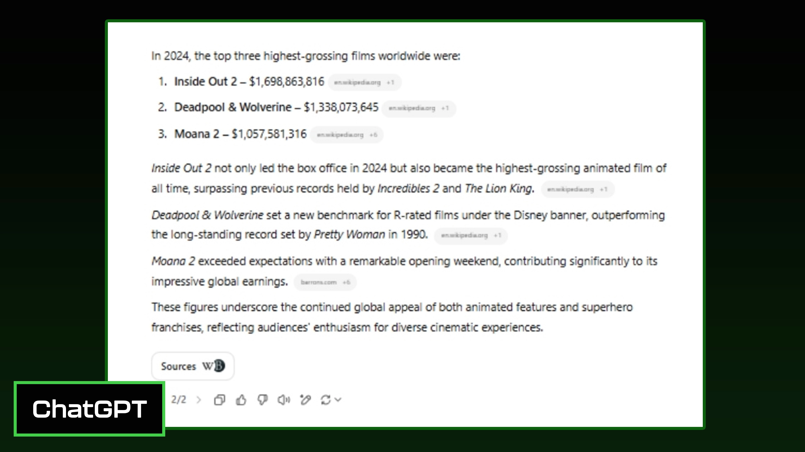

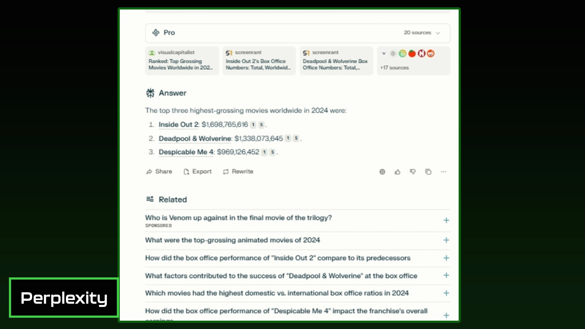

ChatGPT nailed it. Listed the top three, including "Moana 2," which made way more money than "Despicable Me 4." Clean, accurate, done.

Perplexity? Wrong answer. It listed "Despicable Me 4" as number three when it shouldn't have been there at all. Sure, it threw in some "related queries" at the bottom, which might be helpful if you're browsing. But when the main answer is incorrect, those extras don't really save it.

This is the kind of thing that matters when you're relying on AI for quick facts. If it can't get basic data right, what else is it messing up?

**Winner: ChatGPT**

## 2. Creativity & natural language

**Prompt:** *"Create a whimsical conversation between a coffee mug and a smartphone, arguing about which one is more essential in daily life."*

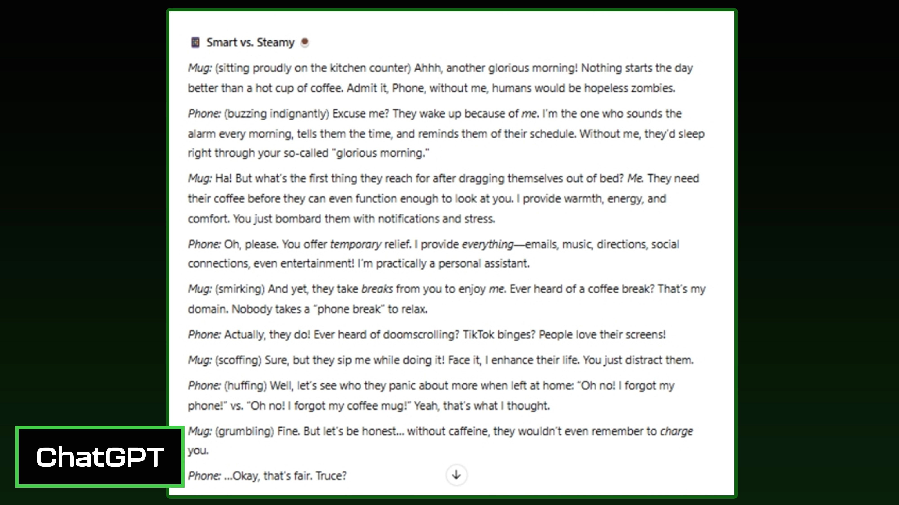

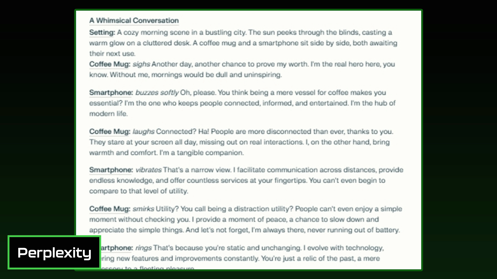

ChatGPT came out swinging with personality. The mug and phone had distinct voices, snappy comebacks, even stage directions that made the whole thing feel alive. It was fun to read. Like watching two characters actually argue, not just recite talking points.

Perplexity's version felt... stiff. More like two people giving speeches at each other than having a conversation. The mug says its piece, the phone says its piece, and that's it. No banter. No spark. The ending just kind of fizzled out.

👉 [Want an AI that actually understands creative prompts and delivers engaging results?](https://pplx.ai/ixkwood69619635)

If you're using AI for creative writing, brainstorming, or anything that needs a human touch, ChatGPT is the one you want. Perplexity can handle facts, but it doesn't know how to play.

**Winner: ChatGPT**

## 3. Efficiency & reasoning

**Prompt:** *"A couple needs to choose between buying an electric car or a traditional gasoline car. List key factors they should consider and briefly explain the reasoning behind each one."*

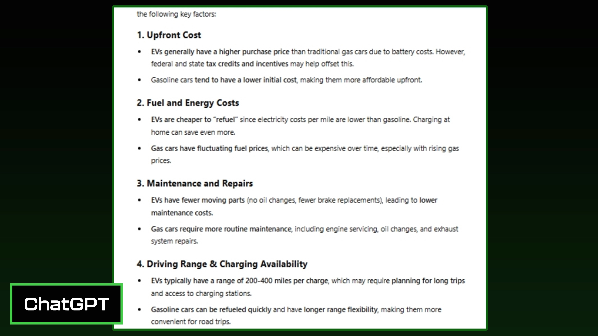

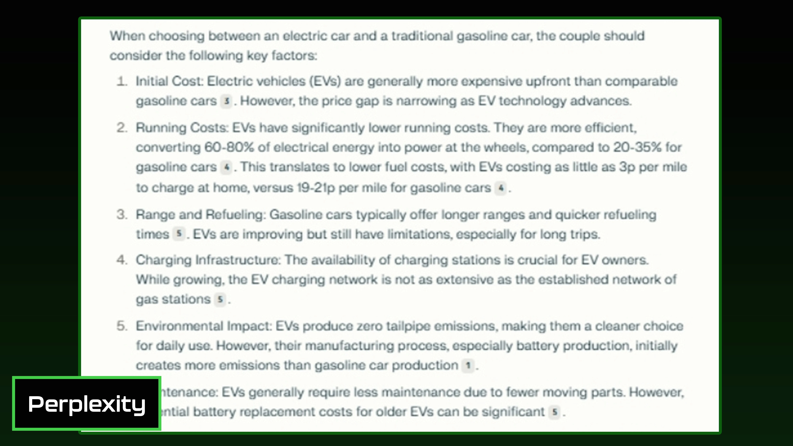

ChatGPT laid it out clean. Bullet points. Clear sections. Easy to skim. It covered the important stuff—cost, charging, environmental impact—and then wrapped it up with a summary that actually helped you make a decision.

Perplexity gave you the information, sure. But it was buried in dense paragraphs. Some points repeated. No clear side-by-side comparison. No summary. Just... here's a bunch of stuff, good luck figuring it out.

When you're trying to make a real decision, format matters. ChatGPT understood that. Perplexity didn't.

**Winner: ChatGPT**

## 4. Usefulness & depth

**Prompt:** *"Provide detailed instructions on how to safely back up and secure personal digital files, including the best tools, recommended practices, and common mistakes to avoid."*

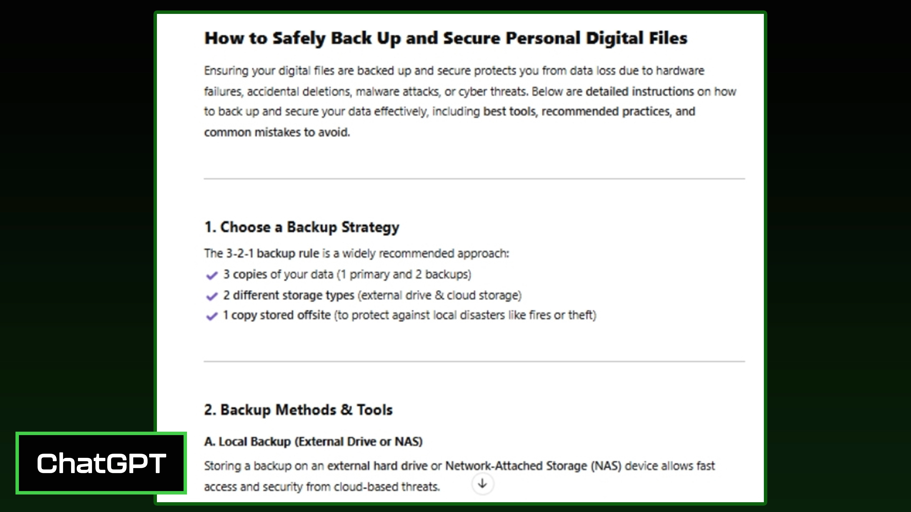

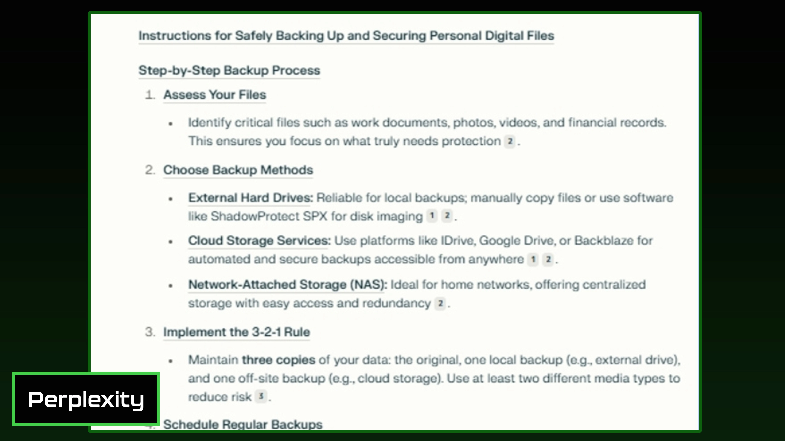

ChatGPT gave you a guide you could actually follow. Step-by-step. Headers. Bullet points. Even threw in some emojis to keep it friendly. It covered tools, best practices, common mistakes—everything you'd need to actually do the thing.

Perplexity's response felt like a research paper. Dense. Lots of inline citations. Harder to skim. Less actionable. It had the information, but it wasn't organized in a way that made you want to use it.

If you're looking for practical advice you can act on right now, ChatGPT wins. Perplexity is better if you're writing a report and need sources.

**Winner: ChatGPT**

## 5. Understanding context

**Prompt:** *"Create a storyboard outline describing each frame of a short animated sequence featuring a friendly dragon teaching kids about recycling."*

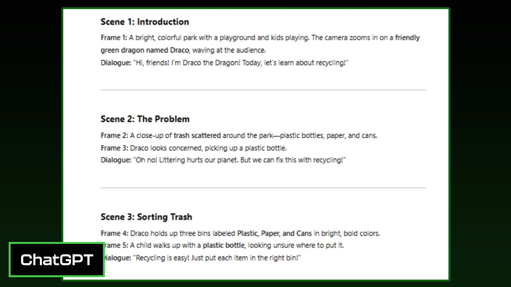

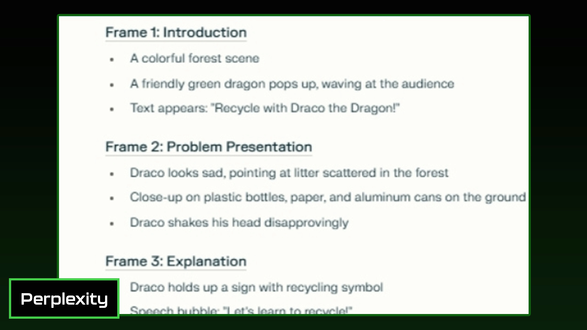

ChatGPT understood the assignment. It created an actual animated sequence—beginning, middle, end. The dragon had personality. The kids were involved. There was magic, interaction, a clear story arc. It felt like something you'd actually want to watch.

Perplexity's version read like an instruction manual. The dragon explained recycling. The kids watched. That's it. No magic. No fun. The kids didn't even participate—they just stood there while the dragon did all the work.

If you're working on anything that needs storytelling, emotional engagement, or a sense of flow, ChatGPT gets it. Perplexity doesn't.

**Winner: ChatGPT**

## Overall winner: ChatGPT

ChatGPT won every single round. Not because Perplexity is bad—it's not. But ChatGPT consistently delivered richer, more engaging, more useful responses. It understood context better. It formatted information in ways that made sense. It knew when to be creative and when to be practical.

Perplexity has its strengths. If you need quick facts with citations, it's solid. But for everything else—creativity, reasoning, practical guides, storytelling—ChatGPT is the better choice.

---

In this head-to-head test, ChatGPT proved itself as the more versatile and user-friendly AI chatbot across accuracy, creativity, and practical usability. While Perplexity AI offers real-time web access and citations, ChatGPT's superior context understanding and engaging responses make it the smarter choice for most tasks. 👉 [Discover why Perplexity excels at research-focused queries with live web data](https://pplx.ai/ixkwood69619635) when you need verifiable sources and up-to-the-minute information.
